<div align="center">

# Nutrition5k — Vision-Based Food Calorie & Nutrition Estimation

**A two-track study of estimating dish-level calories and macronutrients from food images:
a faithful reproduction of the CVPR 2021 *Nutrition5k* paper, and a deployable applied baseline with a live web demo.**

[](https://github.com/google-research-datasets/Nutrition5k)
[](https://austinwang10-food-calorie-app.hf.space/)
[](https://pytorch.org/)
[](https://github.com/T0MYYY/CalBro)
[](https://huggingface.co/T0MYYY/dpf-nutrition)
[](https://huggingface.co/T0MYYY/nutrition5k-experiments)

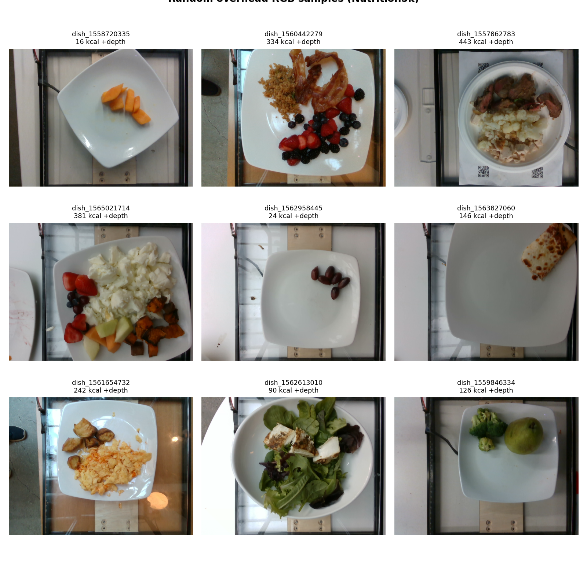

</div>

> **Abstract.** We study dish-level calorie and macronutrient estimation on *Nutrition5k* from two complementary angles. **(i)** We faithfully reproduce the four experiments of the CVPR 2021 paper under the **official** train/test splits, and extend the study to **DPF-Nutrition**'s depth-prediction-and-fusion pipeline. **(ii)** We build a compact, deployable **ResNet-18 RGB/RGB-D** baseline with a live web demo. Our reproduction tracks the paper closely where depth is available — Exp 3 *mass* estimation even **surpasses** the reported result — and a controlled backbone ablation attributes the residual gap to the **unavailable JFT-300M food-domain pretraining** rather than to model capacity.

---

## Highlights

- **Track B — Paper reproduction (`nutrition5k_pkg/`, `notebooks/`).** All four experiments of *Nutrition5k* (CVPR 2021) reproduced under **official train/test splits**, plus an extension reproducing **DPF-Nutrition**. Trains on Google Colab (A100), stores data on Google Drive; the local machine only edits code.
- **Track A — Applied baseline + demo (`webapp/`).** A compact ResNet-18 RGB / RGB-D calorie regressor with an optional Food-101 auxiliary head, shipped as a **Gradio web app on Hugging Face Spaces**.
- **Official splits throughout.** Every experiment uses the official Nutrition5k train/test split files, keeping results directly comparable to the paper.
- **Honest reporting.** Where our numbers fall short of the paper we say so, and we analyse *why* (notably the unavailable **JFT-300M** pretraining), backed by a backbone ablation.
- **Track C — On-device iOS app ([CalBro](https://github.com/T0MYYY/CalBro)).** A native SwiftUI iPhone app that ships the **DPF-Nutrition (RGB + Depth)** model as Core ML and estimates calories/macros from a single overhead photo, fully offline (Depth Anything V2 → DPF). It is an **engineering/UX prototype** — the backbone is not calibrated for phone capture, so its numbers carry no reference value (details in the [CalBro repo](https://github.com/T0MYYY/CalBro)).

> **Two metrics, kept separate.** Track B reports **PMAE** (percentage mean absolute error, the paper's metric). Track A reports **absolute kcal MAE/RMSE** on a storage-limited local subset. They are *not* directly comparable — see [Results at a glance](#results-at-a-glance).

---

## Table of contents

1. [Overview: two complementary tracks](#overview-two-complementary-tracks)
2. [Repository structure](#repository-structure)
3. [The Nutrition5k dataset](#the-nutrition5k-dataset)
4. [Track B — Faithful paper reproduction](#track-b--faithful-paper-reproduction)
5. [Track A — Applied baseline & live demo](#track-a--applied-baseline--live-demo)
6. [Results at a glance](#results-at-a-glance)
7. [Getting started](#getting-started)
8. [Contributors](#contributors)
9. [Citations & acknowledgements](#citations--acknowledgements)

---

## Overview: two complementary tracks

The same problem — *predict the nutrition of a plate of food from images* — is attacked from two angles that complement each other: a rigorous research reproduction and a practical, deployable product.

<p align="center">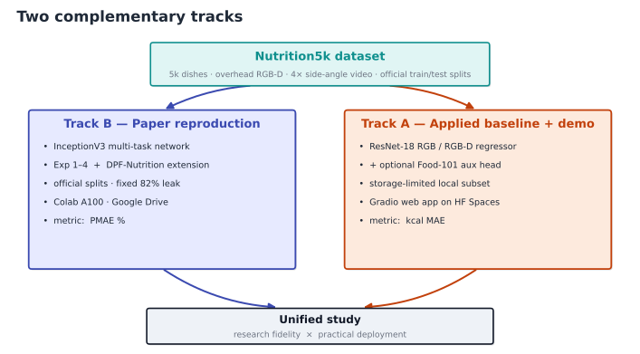</p>
<p align="center"><em><b>Figure 1.</b> The dataset feeds two tracks — a faithful paper reproduction (Track B) and a deployable applied baseline (Track A) — combined into one study.</em></p>

| | **Track B — Reproduction** | **Track A — Applied baseline** |
|---|---|---|
| Goal | Match the paper's numbers & method | Ship a usable calorie estimator |
| Code | repo root (`nutrition5k_pkg/`, `notebooks/`) | `webapp/` |
| Backbone | InceptionV3 (multi-task) + DPF dual-stream ResNet-101 | ResNet-18 (+ optional Food-101 head) |
| Targets | calories, mass, fat, carb, protein | calories (kcal) |
| Splits | **official** rgb/depth split files | official IDs ∩ locally downloaded dishes |
| Compute | Google Colab A100 + Google Drive | laptop-scale subset |
| Metric | **PMAE %** (paper metric) | **kcal MAE / RMSE** |
| Lead | Tom Chen | Yiou (Austin) Wang · Peter Xiong |

---

## Repository structure

```text
nutrition5k/
├── nutrition5k_pkg/          # Track B: installable reproduction package
│   ├── models/               #   InceptionV3 multi-task net, MassRegressor, DPF-Nutrition
│   ├── data/                 #   datasets, official-split loaders, DPF depth dataset
│   ├── train.py  evaluate.py losses.py metrics.py volume.py
├── notebooks/                # Track B: Colab experiment notebooks
│   ├── 00_prepare_data.ipynb
│   ├── exp1_portion_independent.ipynb   exp2_direct_prediction.ipynb
│   ├── exp3_depth_channel.ipynb         exp4_volume_scalar.ipynb
│   ├── exp1_ablation_convnext.ipynb     all_experiments.ipynb
│   └── dpf_nutrition.ipynb              dpf_nutrition_food2k.ipynb
├── configs/                  # Track B: YAML configs (per experiment + ablations)
├── scripts/                  # Track B: local data prep, DPF depth-cache generation
├── tests/                    # Track B: pytest suite (datasets, models, losses, metrics…)
│
└── webapp/                   # Track A: applied baseline + Gradio demo (merged, history preserved)
    ├── model.py  train.py  evaluate.py  evaluate_food101.py  data_loader.py
    ├── web_app.py  app.py    # Gradio UI + Hugging Face Spaces entrypoint
    ├── scripts/              #   Nutrition5k downloaders, presentation-asset generator
    ├── presentation/         #   slide_assets/ + slide_picks/ figures (used below)
    ├── docs/PROJECT_GUIDE.md
    └── README.md             #   detailed web-app manual
```

---

## The Nutrition5k dataset

[*Nutrition5k*](https://github.com/google-research-datasets/Nutrition5k) (Thames et al., CVPR 2021) contains ~5,000 real cafeteria dishes. Each dish provides four rotating **side-angle videos**, one RealSense **overhead RGB-D** capture, and ground-truth **calories, mass, and macronutrients** with an ingredient breakdown.

We use the **official split files** throughout Track B:

| Split file | # dishes | Used by |
|---|---:|---|
| `rgb_train_ids.txt` / `rgb_test_ids.txt` | 4059 / 709 | Exp 1, Exp 2 (side-angle) |
| `depth_train_ids.txt` / `depth_test_ids.txt` | 2758 / 507 | Exp 3, Exp 4, DPF (overhead RGB-D) |

> **Official splits.** Every result below uses the official Nutrition5k `*_ids.txt` train/test split files (the loader asserts `train ∩ test = ∅`).

---

## Track B — Faithful paper reproduction

### Compute & storage architecture

The local machine never trains or stores raw data; it only edits code and reads results. All heavy lifting runs on Colab, all artifacts live on Drive.

<p align="center">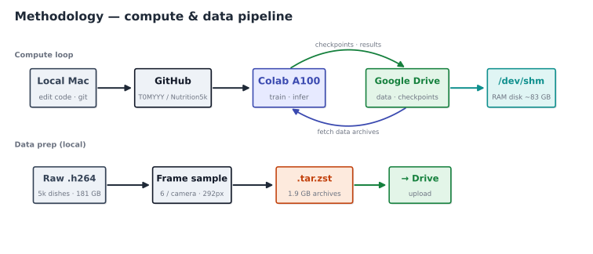</p>
<p align="center"><em><b>Figure 2.</b> Compute & data pipeline — the laptop only edits code; training runs on Colab (A100) against archives staged from Drive into a RAM disk.</em></p>

**Data pipeline.** Raw `.h264` side-angle videos are frame-sampled (6 uniform frames/camera) and pre-scaled to 292 px, then packed as `.tar.zst` archives; overhead RGB-D PNGs and `volume_estimates.csv` are prepared similarly. On Colab the archives stream-decompress into `/dev/shm`, and Exp 1/2 optionally pre-decode all frames into RAM to remove the JPEG-decode bottleneck (~35 s/epoch on A100).

### Model

<p align="center">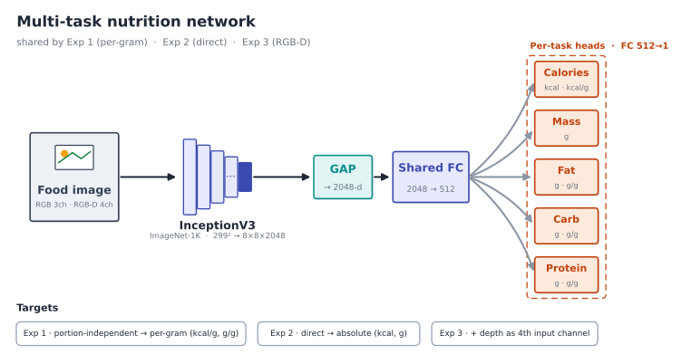</p>
<p align="center"><em><b>Figure 3.</b> Multi-task network (Exp 1–3) — an InceptionV3 backbone feeds a shared trunk and five per-task heads; targets switch between per-gram (Exp 1) and absolute (Exp 2/3), and Exp 3 adds a depth channel.</em></p>

- **Backbone:** `InceptionV3` (ImageNet-1K). *The paper used InceptionV2 pretrained on the proprietary **JFT-300M** — not publicly available; this is the single biggest source of the reproduction gap (quantified by the ablation below).*
- **Multi-task heads:** shared trunk → per-task heads for `calories · mass · fat · carb · protein`.
- **Exp 4 `MassRegressor`:** backbone features **concatenated with a volume scalar** → predicts mass; final calories = predicted mass × predicted cal/g (from the Exp 1 per-gram model).
- **Training:** two-phase (freeze backbone 10 epochs @ `head_lr=1e-3`, then unfreeze @ `lr=3e-4`), Adam, `ReduceLROnPlateau`, equally-weighted L1 multi-task loss.

$$\mathcal{L}_{\text{multi}}=\frac{1}{N}\sum_{i=1}^{N}\Big(\ell^{\text{mass}}_i+\ell^{\text{cal}}_i+\tfrac{1}{3}\!\!\sum_{k\in\{\text{fat},\text{carb},\text{prot}\}}\!\!\ell^{k}_i\Big),\qquad \ell=\lVert\hat{y}-y\rVert_1$$

### The four experiments

Exp 1–3 share the multi-task network above — **Exp 1** uses *per-gram* targets, **Exp 2** *absolute* targets, and **Exp 3** adds depth as a 4th input channel. **Exp 4** instead composes two models: a mass regressor and the frozen Exp 1 per-gram model.

<p align="center">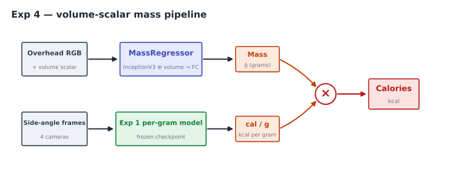</p>
<p align="center"><em><b>Figure 4.</b> Exp 4 — a volume-conditioned mass regressor and the frozen Exp 1 per-gram model are multiplied to recover calories.</em></p>

| Exp | Input | Official split | Target |
|---|---|---|---|
| 1 | side-angle frames | rgb (4059 / 709) | per-gram (kcal/g, g/g) |
| 2 | side-angle frames | rgb (4059 / 709) | absolute (kcal, g) |
| 3 | overhead RGB-D (4ch) | depth (2758 / 507) | absolute (kcal, g) |
| 4 | overhead RGB + volume, side frames | depth (2758 / 507) | mass × cal/g → kcal |

### Reproduction results (calorie PMAE %)

| Experiment | Method | Paper | **Ours** | Ratio |
|---|---|---:|---:|---:|
| Exp 1 | Per-gram, side-angle | 9.5% | **19.1%** | 2.01× |
| Exp 2 | Direct, side-angle | 26.1% | **36.1%** | 1.38× |
| Exp 3 | Direct + depth (RGB-D) | 18.8% | **22.0%** | 1.17× |
| Exp 4 | Volume-scalar pipeline | 16.5% | **24.8%** | 1.50× |

**The gap narrows sharply once depth is available** (Exp 3, 1.17×) — and on **mass**, Exp 3 actually **beats the paper**:

| Exp 3 metric | Paper | Ours |
|---|---:|---:|
| calories | 18.8% | 22.0% |
| **mass** | 18.9% | **17.8%** ✅ |
| fat / carb / protein | 18.1 / 23.8 / 20.9% | 32.3 / 31.6 / 31.1% |

This is strong evidence that our RGB-D data pipeline and evaluation are correct: real depth carries genuine mass/volume signal, and we capture it.

### Ablation — is the gap a backbone problem?

We swapped InceptionV3 (ImageNet-1K) for **ConvNeXt-Small (ImageNet-22K)** on Exp 1:

| Metric | InceptionV3 | ConvNeXt-Small | Δ |
|---|---:|---:|---:|
| cal/g PMAE | 19.1% | 19.0% | ≈ 0 |
| fat / carb / protein | 28.5 / 26.2 / 21.7% | 28.0 / 25.5 / 21.5% | ≤ 0.7pp |

**Conclusion: a stronger *general* backbone does not close the gap.** The remaining train/val gap points to a *data-diversity / domain-pretraining* ceiling, not model capacity — i.e. JFT-300M's value is the **quality** of its fine-grained food supervision, not merely its scale.

### DPF-Nutrition extension

A second study reproduces **DPF-Nutrition**: a frozen monocular depth predictor feeds a dual-stream RGB-D network with cross-attention fusion.

<p align="center">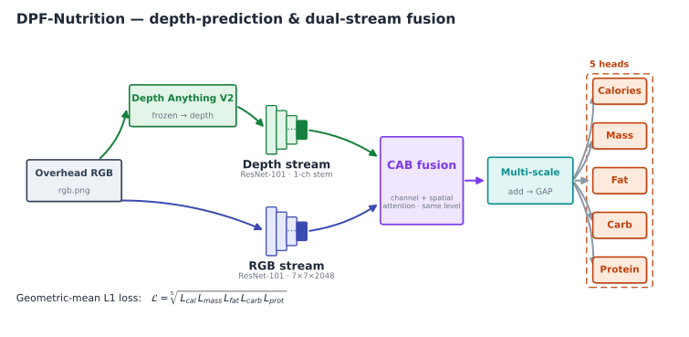</p>
<p align="center"><em><b>Figure 5.</b> DPF-Nutrition — a frozen Depth Anything V2 predictor feeds a depth stream that fuses with the RGB stream via cross-attention (CAB) and multi-scale aggregation.</em></p>

Following DPF-Nutrition, the five tasks are combined with a **geometric-mean** L1 loss (PMAE is used only as an evaluation metric, never as a training objective):

$$\mathcal{L}_{\text{DPF}}=\sqrt[5]{\,\mathcal{L}_{\text{cal}}\;\mathcal{L}_{\text{mass}}\;\mathcal{L}_{\text{fat}}\;\mathcal{L}_{\text{carb}}\;\mathcal{L}_{\text{prot}}\,}$$

| Metric (PMAE) | ImageNet init | **Food2K init** | DPF paper |
|---|---:|---:|---:|
| calories | 18.0% | 18.0% | 14.7% |
| mass | 15.7% | 15.4% | 10.6% |
| fat / carb / protein | 27.7 / 28.0 / 26.3% | 27.7 / 26.6 / 25.6% | 22.6 / 20.7 / 20.2% |
| **mean** | 23.12% | **22.67%** | 17.8% |

Food-domain (**Food2K**) pretraining helps (mean 23.12% → 22.67%, mainly carb/protein/mass), but doesn't fully close the gap — consistent with the ablation: the residual is implementation detail + the **Depth Anything V2** vs the paper's depth predictor domain shift + 3 missing training dishes, not backbone capacity alone.

### Why the gap? — a structured analysis

<p align="center">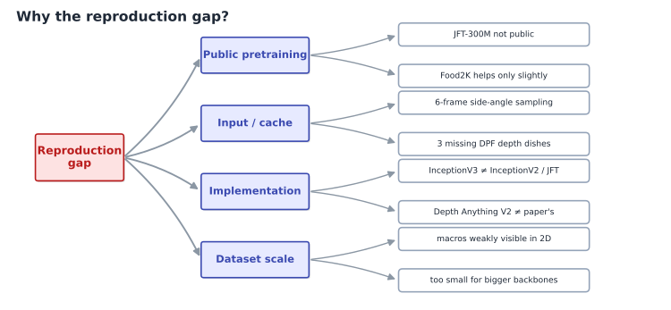</p>
<p align="center"><em><b>Figure 6.</b> The reproduction gap decomposed — public-pretraining, input/cache, implementation, and dataset-scale factors, with the JFT-300M gap as the dominant cause.</em></p>

**Takeaways.** (1) The gap is **largest for side-angle RGB** and **smallest once real depth is available** — depth carries the mass/volume signal the paper relies on. (2) Exp 3 *mass* **beats** the paper, validating our RGB-D pipeline and evaluation. (3) The ablation rules out *general* backbone capacity as the bottleneck; the decisive missing ingredient is **food-domain pretraining at JFT-300M scale**. (4) Under public resources, our results are a *faithful, well-characterised* reproduction: correct trends, honest gap, identified causes.

---

## Track A — Applied baseline & live demo

A pragmatic, deployable model. **[▶ Try the live demo](https://austinwang10-food-calorie-app.hf.space/)** — upload a food photo and get a calorie estimate.

### Pipeline & model

A pretrained **ResNet-18** extracts features; a small `512 → 128 → 1` head regresses **log1p(calories)** (decoded with `expm1` at eval). The **RGB-D** variant adds depth as a 4th input channel (first conv adapted, the extra channel initialised from the mean of the RGB filters). An optional **Food-101** classification head shares the backbone for auxiliary supervision.

<p align="center">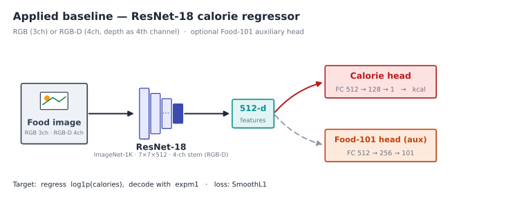</p>
<p align="center"><em><b>Figure 7.</b> Applied baseline — ResNet-18 with a calorie-regression head and an optional Food-101 auxiliary head; RGB-D uses a 4-channel stem.</em></p>

**Training.** AdamW · SmoothL1 on log-calories · `ReduceLROnPlateau` · early stop (patience 10) · 40 epochs. **Data scope:** a storage-limited local **overhead** subset (official IDs ∩ downloaded dishes): **train 2160 / val 240 / test 507**.

<p align="center">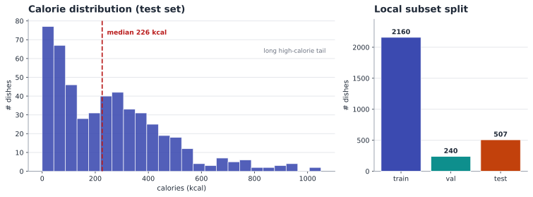</p>
<p align="center"><em><b>Figure 8.</b> Calorie distribution of the held-out test split (left) and the train/val/test split sizes (right) — most dishes fall below 400 kcal, with a long high-calorie tail.</em></p>

### Results

The RGB-D model is the primary; an RGB-only model is the controlled comparison (same recipe, input only differs).

| Run | Input | Best val MAE | Test **MAE** | Test **RMSE** |
|---|---|---:|---:|---:|
| **Primary** | RGB + depth | 70.81 kcal @ ep 12 | **79.10 kcal** | **125.89 kcal** |
| Comparison | RGB only | 65.98 kcal @ ep 23 | 80.31 kcal | 127.35 kcal |

<p align="center">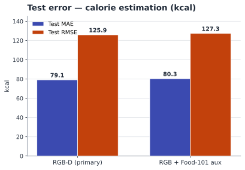</p>
<p align="center"><em><b>Figure 9.</b> Held-out test error. RGB-D edges out RGB by ~1.2 kcal MAE.</em></p>

Depth helps only marginally — the overhead RGB photo already encodes most of the dish-type and rough-portion signal. Error grows with calorie level and the residual spread widens for large dishes (hidden mass / calorie-dense ingredients):

<p align="center">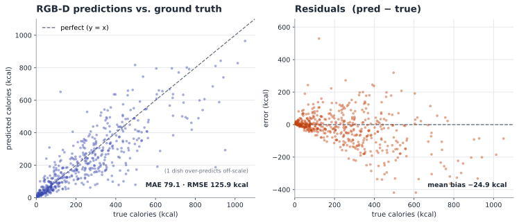</p>
<p align="center"><em><b>Figure 10.</b> RGB-D predictions track the diagonal; residuals fan out and the model under-predicts on average (−24.9 kcal bias).</em></p>

<p align="center">
  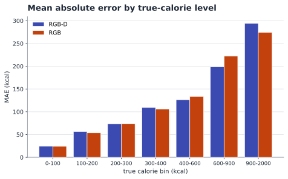
  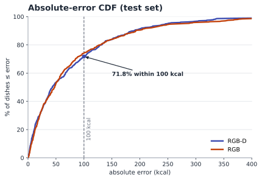
</p>
<p align="center"><em><b>Figure 11.</b> Error rises with true calories (left); <b>71.8%</b> of dishes land within 100 kcal (right, median 43.5 kcal).</em></p>

<p align="center">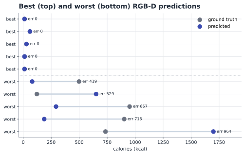</p>
<p align="center"><em><b>Figure 12.</b> Per-dish predictions — the five best (near-perfect) and five worst (large, mostly under-prediction) RGB-D cases.</em></p>

The optional **Food-101 auxiliary head** learns reasonable category accuracy during multi-task training without degrading the calorie objective.

### Inference flow

<p align="center">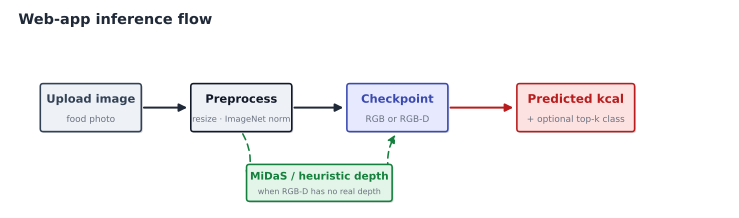</p>
<p align="center"><em><b>Figure 13.</b> Inference path of the live demo; for RGB-D inputs without a real depth map, MiDaS or a heuristic supplies an estimated depth channel.</em></p>

> **Scope, stated honestly.** Track A is a **controlled local-subset baseline**, *not* a full-dataset leaderboard reproduction — all compared models use the same fixed local test dishes, seed, and metrics. The detailed web-app manual lives in [`webapp/README.md`](webapp/README.md).

---

## Results at a glance

<p align="center">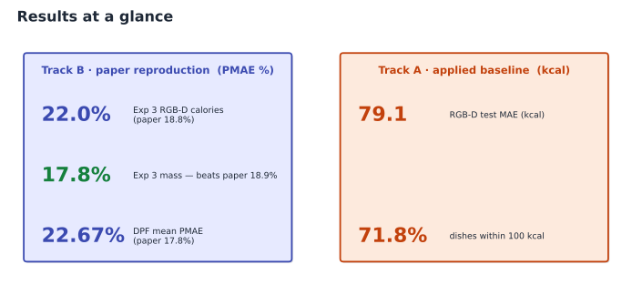</p>
<p align="center"><em><b>Figure 14.</b> Headline results — Track B in paper PMAE % (Exp 3 mass beats the paper), Track A in absolute kcal. The two metric systems are not directly comparable.</em></p>

**Reading the two tracks together.** Track B answers *“how close can a public-resource reproduction get to the paper?”* — close on depth-driven mass, with a well-characterised gap elsewhere driven by unavailable JFT-300M pretraining (not model capacity). Track A answers *“what does a deployable, laptop-scale model actually deliver?”* — a usable ±79 kcal estimator with a public demo. **The metrics are intentionally different (PMAE % vs absolute kcal) and should not be compared head-to-head.**

---

## Limitations & future work

| Limitation | Planned mitigation |
|---|---|
| **No JFT-300M / food-scale pretraining** (Track B) — main accuracy gap | Source a closer food-domain backbone; quantify against a same-split ImageNet baseline |
| **6-frame side-angle sampling** loses temporal detail | Re-pack archives at 15–20 frames/camera and re-measure Exp 1/2 |
| **DPF depth predictor is a substitute** (Depth Anything V2) | Compare against a predictor closer to the paper on the same split; restore the 3 missing `depth_train` dishes |
| **Track A trains on a storage-limited subset**, not full Nutrition5k | Scale to the full overhead release as hardware allows; keep the fixed test set for comparability |
| **Macros are weakly observable** from 2D appearance | Add ingredient/portion reasoning; stronger RGB-D fusion |
| **Overfitting** on per-gram tasks (train ≪ val loss) | Mixup / stronger regularisation for Exp 1/2 |

---

## Getting started

### Track B — reproduction (Colab + Drive)

```bash
pip install -e .                       # installs nutrition5k_pkg
# Open a notebook in Colab (A100 recommended):
#   notebooks/all_experiments.ipynb    → Exp 1–4 end-to-end
#   notebooks/dpf_nutrition.ipynb       → DPF-Nutrition
# Configs live in configs/colab/*.yaml ; data & checkpoints live on Google Drive.
pytest                                 # run the test suite locally
```

### Track A — web-app baseline & demo

```bash
cd webapp
pip install -r requirements.txt
# Download data (needs gsutil), then train / evaluate:
python scripts/download_nutrition5k.py --dataset_root ~/data/nutrition5k_mini --tier essentials overhead
python train.py    --dataset_root ~/data/nutrition5k_mini --mode rgbd --split_type depth --epochs 40 \
                   --loss_type smooth_l1 --scheduler plateau --use_log_target --pretrained
python evaluate.py --dataset_root ~/data/nutrition5k_mini --mode rgbd --split_type depth \
                   --checkpoint_path outputs/checkpoints/best.pt
python web_app.py  --checkpoint_rgbd outputs/checkpoints/best.pt   # local Gradio UI
```

Full CLI reference: [`webapp/README.md`](webapp/README.md).

---

## Contributors

| Contributor | Role |
|---|---|
| **Tom Chen** | Paper reproduction (Track B): Exp 1–4, DPF-Nutrition, Colab/Drive pipeline, ablations |
| **Yiou (Austin) Wang** | Applied baseline & web demo (Track A): model, training, evaluation, Gradio app, Hugging Face Spaces deployment |
| **Peter Xiong** | Applied baseline (Track A): Windows tooling, presentation-asset generation |

---

## Citations & acknowledgements

**Nutrition5k (reproduced paper):**

```bibtex
@inproceedings{thames2021nutrition5k,
  title     = {Nutrition5k: Towards Automatic Nutritional Understanding of Generic Food},
  author    = {Thames, Quin and Karpur, Arjun and Norris, Wade and Xia, Fangting
               and Panait, Lucian and Weyand, Tobias and Sim, Jack},
  booktitle = {Proceedings of the IEEE/CVF Conference on Computer Vision and Pattern Recognition (CVPR)},
  year      = {2021}
}
```

- 📄 Paper: [arXiv:2103.03375](https://arxiv.org/abs/2103.03375) · 📦 Dataset & official code: [google-research-datasets/Nutrition5k](https://github.com/google-research-datasets/Nutrition5k)
- **DPF-Nutrition** (2023) — *Food Nutrition Estimation via Depth Prediction and Fusion*; reproduced in Track B's DPF extension.
- **Depth Anything V2** — used as the frozen monocular depth predictor in the DPF pipeline.
- Reference implementations consulted: [SightVanish/NutritionEstimation](https://github.com/SightVanish/NutritionEstimation) · [Lyce24/NutriFusionNet](https://github.com/Lyce24/NutriFusionNet).

This repository is an academic coursework project. The Nutrition5k dataset is distributed by Google Research under its own license; please consult the [official dataset repository](https://github.com/google-research-datasets/Nutrition5k) for data terms.
