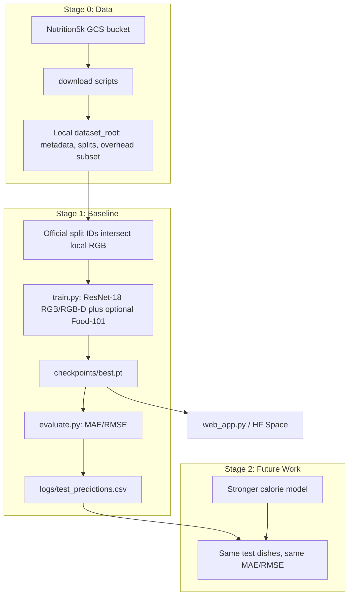

# Project Guide: Data Scope, Download, and Research Pipeline

This guide consolidates the old project notes into one organized reference. It explains what data is used, why the storage-limited subset is methodologically valid for this baseline, how to download more Nutrition5k data, and how future models should be compared.

---

## 1. Research Pipeline



In one sentence: we download the Nutrition5k overhead data that fits on student laptops, train a reproducible ResNet-18 baseline, freeze the test evaluation, and compare future models on the same dish IDs.

---

## 2. Data Scope and Justification

We use official Nutrition5k labels and split files, restricted to dishes whose overhead RGB image exists locally. This is a storage-limited official subset, not a random custom mini-dataset.

```text
train / validation / test examples =
official_split_ids intersect {dish_id | local overhead RGB exists}
```

### Hardware Constraint

| Resource | Official release | Laptop setup |
|----------|------------------|--------------|
| Full bundle | about 181 GB including side-angle video | not downloaded |
| Overhead RGB-D | about 3,490 dish folders | downloaded incrementally |
| Required for this repo | metadata, splits, overhead RGB/depth | fits as a subset |

The baseline in this repository does not use the side-angle videos, so the full 181 GB release is not required for the current model.

### What Remains Methodologically Sound

| Rule | Why it matters |
|------|----------------|
| Official calorie labels | targets come from `metadata/dish_metadata_cafe1.csv` and `metadata/dish_metadata_cafe2.csv` |
| Official split IDs | train/test come from `dish_ids/splits/`, not from a custom random test split |
| No test leakage | validation is carved from official train IDs; test comes from official test IDs only |
| Transparent local filter | unavailable images are skipped because they are not on disk; EDA reports actual counts |
| Fixed comparison set | RGB, RGB-D, and future models should use the same test dishes and same MAE/RMSE |

We do not claim a full Nutrition5k leaderboard reproduction. We claim a controlled local-subset baseline that uses official labels, official split conventions, and reproducible evaluation.

---

## 3. Stage 1 Baseline

| Component | Role |
|-----------|------|
| `data_loader.py` | loads official split IDs, resolves local RGB/depth files, builds train/val/test samples |
| `model.py` | defines `CalorieRegressor`, a ResNet-18 backbone with calorie regression and optional Food-101 classification head |
| `train.py` | trains the calorie model, runs validation, saves checkpoints and logs |
| `evaluate.py` | reports test MAE/RMSE and can export per-dish predictions |
| `evaluate_food101.py` | evaluates the optional Food-101 classifier branch |
| `web_app.py` | serves the RGB/RGB-D demo with saved checkpoints |

Artifacts to keep for grading and future comparison:

| File | Purpose |
|------|---------|
| `logs/config.json` | seed, split type, data settings, training config |
| `logs/train_summary.json` | best validation MAE and best epoch |
| `logs/eval_metrics.json` | test MAE/RMSE |
| `logs/test_predictions.csv` | fixed per-dish benchmark output |

After the baseline is evaluated, treat the saved test prediction CSV as the comparison contract for later work.

---

## 4. Downloading Nutrition5k

Bucket:

```text
gs://nutrition5k_dataset/nutrition5k_dataset/
```

Install Google Cloud SDK / `gsutil`, then verify access:

```bash
gsutil ls gs://nutrition5k_dataset/nutrition5k_dataset/
```

Recommended laptop workflow:

```bash
export N5K_ROOT="$HOME/data/nutrition5k_mini"
mkdir -p "$N5K_ROOT"

python scripts/download_nutrition5k.py \
  --dataset_root "$N5K_ROOT" \
  --tier essentials

python scripts/download_more_overhead.py \
  --dataset_root "$N5K_ROOT" \
  --target_total 3000
```

Download tiers:

| Tier | Contents |
|------|----------|
| `essentials` | metadata and official split files |
| `overhead` | overhead RGB/depth folders used by this repo |
| `full` | full Nutrition5k release, including side-angle video |

To resume or expand the overhead download:

```bash
python scripts/download_nutrition5k.py \
  --dataset_root "$N5K_ROOT" \
  --tier overhead \
  --only_missing
```

To request all missing split dishes with the legacy helper:

```bash
python scripts/download_more_overhead.py \
  --dataset_root "$N5K_ROOT" \
  --target_total 0
```

Check downloaded overhead folders:

```bash
python scripts/check_overhead_integrity.py --dataset_root "$N5K_ROOT"
```

---

## 5. Fair Evaluation Protocol

1. Train and validation examples come from official train IDs that have local RGB.
2. Validation uses `--val_ratio` and `--seed`; it is never drawn from the test IDs.
3. Test examples come from official test IDs that have local RGB.
4. All compared runs must keep the same `--split_type`, `--seed`, and test set.
5. Report MAE and RMSE in kcal using `evaluate.py`.
6. Save `logs/test_predictions.csv` so future models can be compared dish by dish.

Copy-ready wording:

> We use Nutrition5k overhead imagery with official calorie labels and train/test split files. Because of laptop storage limits, training uses the subset of official train IDs with locally downloaded RGB. Test metrics use official test IDs available locally. This supports a controlled Stage-1 baseline rather than a full-dataset Nutrition5k leaderboard reproduction.

---

## 6. Scaling Up

When storage and hardware improve, download more overhead folders and point `--dataset_root` to the larger tree. No loader changes are required. For fair comparison, keep the same test IDs or explicitly define a new benchmark before reporting new results.

Future work should compare against the Stage 1 baseline using the same dish IDs, targets, and metrics. This keeps improvements attributable to the model rather than to changed data splits.
