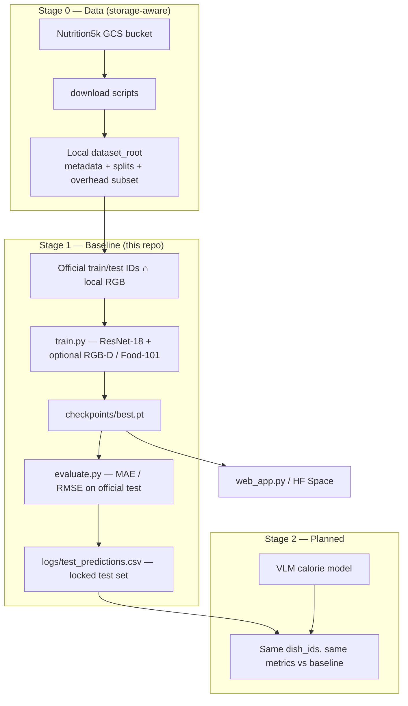

# Research pipeline — logical overview

This document is the **single narrative** for the project: what we build, in what order, and why each step is valid under **limited laptop storage**. Detailed download steps live in [DOWNLOAD_NUTRITION5K.md](DOWNLOAD_NUTRITION5K.md). Data-scope defense for reviewers lives in [DATA_SCOPE.md](DATA_SCOPE.md).

---

## End-to-end flow



**In one sentence:** We download what fits on disk, train a **baseline** on official splits, **freeze test-set evaluation**, then (later) compare a **VLM** on that same test set.

---

## Stage 0 — Data acquisition

| Step | Tool | Output |
|------|------|--------|
| Install GCS client | `gsutil` | Access to public bucket |
| Fetch labels & splits | `download_nutrition5k.py --tier essentials` | `metadata/`, `dish_ids/splits/` |
| Fetch overhead imagery | `--tier overhead` or `--only_missing` / `download_more_overhead.py` | `imagery/realsense_overhead/dish_*/` |
| Sanity check | `check_overhead_integrity.py` | Count of complete vs partial folders |

**Subset rule (not a random sample):**

```text
usable dishes = official split IDs  ∩  { dish_id | local overhead RGB exists }
```

Implemented in `data_loader.build_split_samples()`. Missing downloads are skipped and reported; EDA figures show real counts.

**Why a subset is acceptable here:** Stage 1 is a **baseline** with ImageNet-pretrained ResNet-18; we need enough train dishes to stabilize regression and a **fixed official test set** for metrics—not every GCS train ID on disk.

---

## Stage 1 — Baseline model (current codebase)

| Component | Role |
|-----------|------|
| `data_loader.py` | Official splits, RGB/RGB-D tensors, augmentations |
| `model.py` | `CalorieRegressor` — ResNet-18 + MLP head (+ optional Food-101 cls) |
| `train.py` | Train/val loops, early stopping, optional Food-101 epochs |
| `evaluate.py` | Test MAE, RMSE, optional per-dish CSV |
| `evaluate_food101.py` | Optional classifier top-1 on Food-101 test |
| `web_app.py` | Gradio demo (RGB / RGB-D checkpoints) |

**Typical experiment matrix (same protocol):**

- RGB vs RGB-D (`--mode`, matching `--split_type`)
- Optional `--enable_food101_cls` for auxiliary classification

**Artifacts to keep for grading and for Stage 2:**

| File | Purpose |
|------|---------|
| `logs/config.json` | `seed`, `split_type`, `val_ratio`, `dataset_root` |
| `logs/train_summary.json` | Best val MAE, epoch |
| `logs/eval_metrics.json` | Baseline test MAE / RMSE |
| `logs/test_predictions.csv` | **Frozen test evaluation set** (dish_id, targets, preds) |

---

## Stage 2 — VLM (planned, not in this repo yet)

| Principle | Detail |
|-----------|--------|
| Same labels | `total_calories` from same metadata |
| Same test dishes | Same `dish_id` list as Stage 1 CSV (or regenerate with same `split_type` + `seed`) |
| Same metrics | MAE, RMSE (kcal); report delta vs baseline |
| Train data | May use more overhead folders if storage grows; **do not change test IDs** mid-study |

The baseline is a **controlled reference**, not claimed SOTA. Improvements in Stage 2 are attributed to the VLM, not to re-sampling test data.

---

## Evaluation protocol (fair comparison)

1. **Train/val** — Official train IDs (local RGB only); val = held-out fraction of those train IDs (`--val_ratio`, `--seed`).
2. **Test** — Official test IDs only (local RGB only); never used for hyperparameter tuning in the baseline script.
3. **Metrics** — MAE and RMSE on test; optional error-by-calorie-bin plots via `generate_presentation_assets.py`.
4. **Cross-stage lock** — After Stage 1, treat `test_predictions.csv` as the contract for Stage 2.

---

## Presentation & figures

```bash
python scripts/generate_presentation_assets.py \
  --dataset_root <your_root> \
  --run_dir <outputs_dir> \
  --split_type depth --val_ratio 0.1 --seed 42
```

Outputs: `presentation/slide_assets/` (full), `presentation/slide_picks/` (curated for slides). Quote **your** EDA sample counts in the report.

---

## What we claim vs do not claim

| We claim | We do not claim |
|----------|-----------------|
| Official Nutrition5k labels and split conventions on local overhead subset | Full reproduction of paper leaderboard on entire GCS release |
| Reproducible baseline + documented test MAE/RMSE | Final production system (VLM comes later) |
| Fair future comparison via fixed test set | Training on all official train IDs if not downloaded |
| RGB vs RGB-D ablation under same codepath | Identical numbers to CVPR 2021 without their full media |

---

## Suggested report paragraph (copy-ready)

> **Approach.** We implement a two-stage research pipeline on Nutrition5k overhead imagery. Due to laptop storage limits, we host a subset of official overhead dishes while keeping Google's train/test split files and calorie labels. **Stage 1** trains an ImageNet-pretrained ResNet-18 baseline to validate the data pipeline and record reference test MAE/RMSE on a fixed official test set (`evaluate.py --save_predictions_csv`). **Stage 2** will introduce a vision–language model evaluated on the **same test dishes and metrics**, so improvements reflect model capacity rather than split changes. Baseline results support modality comparison (RGB vs RGB-D) and optional Food-101 auxiliary training within this controlled setup.

---

## Document map

| Doc | Contents |
|-----|----------|
| [RESEARCH_PIPELINE.md](RESEARCH_PIPELINE.md) | This file — full logical flow |
| [DATA_SCOPE.md](DATA_SCOPE.md) | Subset + baseline + VLM justification for reviewers |
| [DOWNLOAD_NUTRITION5K.md](DOWNLOAD_NUTRITION5K.md) | GCS download commands |
