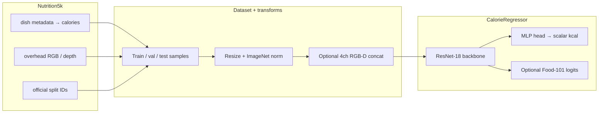

# Model pipeline (for slides)

Static overview of this repository’s calorie model. No execution required for this page.

## End-to-end flow

## Training vs inference

- **Training**: SmoothL1 or MSE on targets (optional `log1p` target), ReduceLROnPlateau, early stopping on val MAE; optional auxiliary Food-101 cross-entropy on scheduled epochs.
- **Inference / evaluation**: Load `best.pt`, forward pass only; metrics from saved predictions require `evaluate.py` with `--save_predictions_csv` (still not retraining).

## Exporting this diagram

- GitHub renders Mermaid in `.md` files automatically.
- For Keynote/PowerPoint, paste the mermaid block into [mermaid.live](https://mermaid.live) and export PNG/SVG.
