# Nutrition5k Calorie Prediction

## End-to-End Food Calorie Estimation from Overhead RGB and RGB-D Images


**Goal:** predict total dish calories in kcal from food images.

**Project outcome:** a complete machine learning pipeline with data loading, EDA, preprocessing, model training, evaluation, error analysis, and a web demo.

---

## What Is Nutrition5k?

Nutrition5k is a food dataset where each dish has both **visual data** and **nutrition labels**.

For each dish, the dataset can include:

| Information | Audience-Friendly Meaning |
|-------------|---------------------------|
| Overhead RGB image | what the food looks like from above |
| Depth image | rough 3D shape / distance information |
| Total calories | the value we train the model to predict |
| Mass and macros | extra nutrition information such as grams, fat, carbs, protein |
| Ingredient list | what the dish is made of |
| Train/test split | official split assignment for fair evaluation |

In this project, the model only predicts **total calories**. RGB and depth are used as image inputs, while the official labels are used as ground truth.

---

## One Dish Example

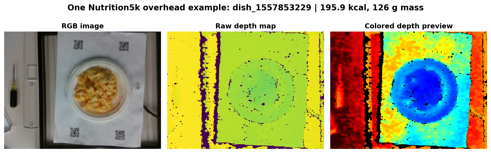

This example shows the actual input style: an overhead food image, a raw depth map, and a colored depth preview. The label for this dish is **195.93 kcal**.

| Field | Value |
|-------|------:|
| Dish ID | `dish_1557853229` |
| Total calories | 195.93 kcal |
| Total mass | 126.00 g |
| Fat | 13.23 g |
| Carbohydrates | 1.51 g |
| Protein | 15.75 g |
| Ingredient | eggs |

---

## Data Split and Calorie Distribution

<table>
  <tr>
    <td width="58%">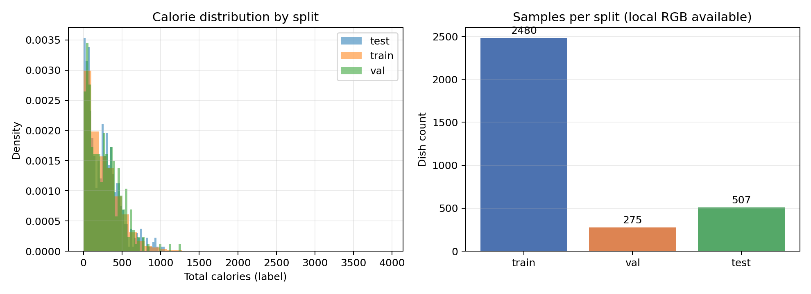</td>
    <td width="42%">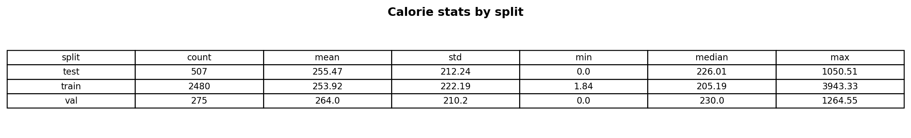</td>
  </tr>
</table>

This plot shows that most dishes are below 400 kcal, while a smaller number of high-calorie dishes create a long tail.

| Split | Dishes | Mean kcal | Median kcal | Max kcal |
|-------|-------:|----------:|------------:|---------:|
| Train | 2160 | 254.5 | 208.1 | 1324.1 |
| Validation | 240 | 272.9 | 247.4 | 1119.3 |
| Test | 507 | 255.5 | 226.0 | 1050.5 |

---

## RGB-D Data Coverage

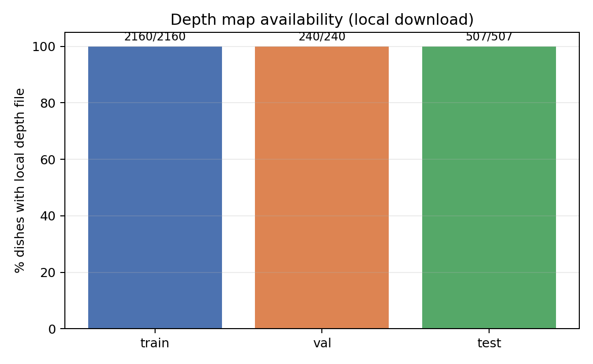

This plot confirms that every dish in the local train, validation, and test split has a depth file, so RGB-D evaluation is available for the full local subset.

| Split | Dishes with depth | Total dishes | Coverage |
|-------|------------------:|-------------:|---------:|
| Train | 2160 | 2160 | 100.0% |
| Validation | 240 | 240 | 100.0% |
| Test | 507 | 507 | 100.0% |

---

## End-to-End Project Pipeline

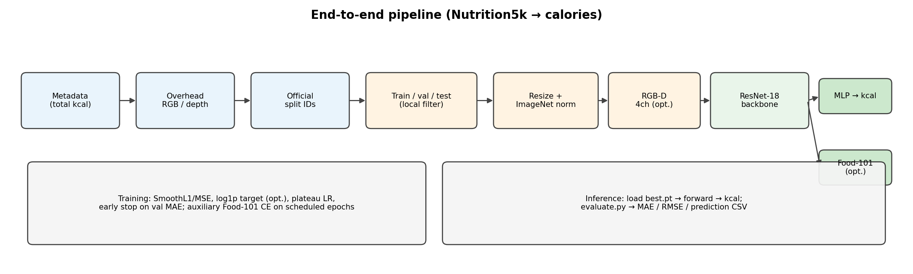

This diagram shows the full workflow: Nutrition5k labels and images become model-ready tensors, then the trained model produces calorie predictions and evaluation plots.

For fairness, the dataset builder starts from the official Nutrition5k split IDs and then keeps only dishes that have local overhead images available. This avoids creating a random custom split while still respecting laptop storage limits.

| Stage | What Happens |
|-------|--------------|
| Data | collect dish labels, RGB images, depth images, and official splits |
| Dataset | build train, validation, and test examples from available local dishes |
| Preprocessing | resize and normalize images; add depth channel for RGB-D |
| Model | train ResNet-18 to output one calorie value |
| Evaluation | compute MAE/RMSE and save per-dish predictions |
| Demo | load checkpoint and predict calories from uploaded images |

---

## Preprocessing Pipeline

Preprocessing is the bridge between raw Nutrition5k files and tensors that a neural network can train on. The goal is to make every input image the same size, same numeric scale, and same channel layout.

### RGB Mode

```text
RGB image -> resize to 224x224 -> tensor -> ImageNet normalization
```

In RGB mode, the model only sees the overhead color photo. This is the simpler baseline and answers the question: how much can we learn from the food image alone?

### RGB-D Mode

```text
RGB tensor + normalized depth tensor -> 4-channel input
```

In RGB-D mode, the model sees the same RGB image plus a depth channel. Depth gives rough shape and height information, which may help estimate volume or portion size. The raw depth map is normalized and clipped so sensor values fit a stable `[0, 1]` range.

### Target Handling

| Step | Representation |
|------|----------------|
| Training target | `log1p(total_calories)` |
| Prediction output | decoded back with `expm1` |
| Final metrics | kcal-space MAE and RMSE |

The model trains on log calories because the calorie distribution has a long tail. At evaluation time, predictions are converted back to real kcal so the final numbers are easy to understand.

---

## Model Architecture: RGB Baseline

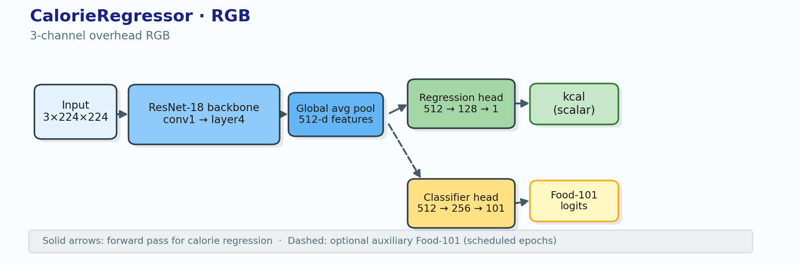

This model uses a normal 3-channel food image. A pretrained ResNet-18 extracts visual features, and a small regression head maps those features to one calorie prediction.

| Component | Design |
|-----------|--------|
| Backbone | ImageNet-pretrained ResNet-18 |
| Feature vector | 512 dimensions |
| Regression head | `512 -> 128 -> 1` |
| Output | predicted calories |

---

## Model Architecture: RGB-D Primary Model

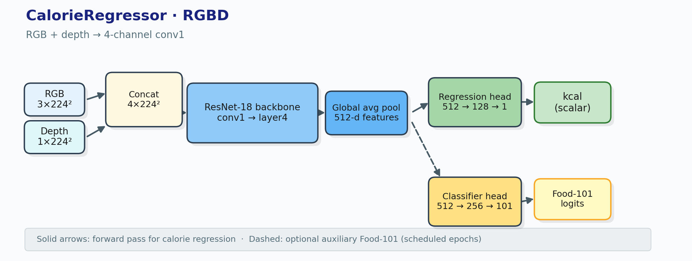

The RGB-D model extends the RGB model by adding depth as a fourth input channel. The first convolution is adapted from 3 channels to 4 channels so the model can learn from both color and depth.

| Design Choice | Purpose |
|---------------|---------|
| pretrained ResNet-18 | start from strong general image features |
| 4-channel first convolution | accept RGB plus depth |
| small MLP regression head | output one scalar calorie estimate |

---

## Food-101 Category Detection

While training the Nutrition5k calorie model, we also train a small Food-101 category head on the same shared backbone. This means the model can estimate calories and also recognize the food category.

| Output | What It Means |
|--------|---------------|
| Calorie regression | predicts total dish calories in kcal |
| Food category detection | predicts the likely food type, such as pizza, salad, or steak |

On the Food-101 official test set, the RGB checkpoint reaches **48.7% top-1 accuracy** and **75.9% top-5 accuracy**. In simple terms, the correct food category is often included in the model's top few guesses.

---

## Training Setup

| Setting | RGB-D Primary | RGB Comparison |
|---------|---------------|----------------|
| Input | RGB + depth | RGB only |
| Configured epochs | 40 | 40 |
| Optimizer | AdamW | AdamW |
| Loss | SmoothL1 on log calories | SmoothL1 on log calories |
| Scheduler | ReduceLROnPlateau | ReduceLROnPlateau |
| Early stopping patience | 10 | 10 |
| Food-101 classification branch | enabled | enabled |

Both models use the same overall recipe, so the main comparison is the input type: RGB-D vs RGB.

---

## Training Curves

<table>
  <tr>
    <td width="50%">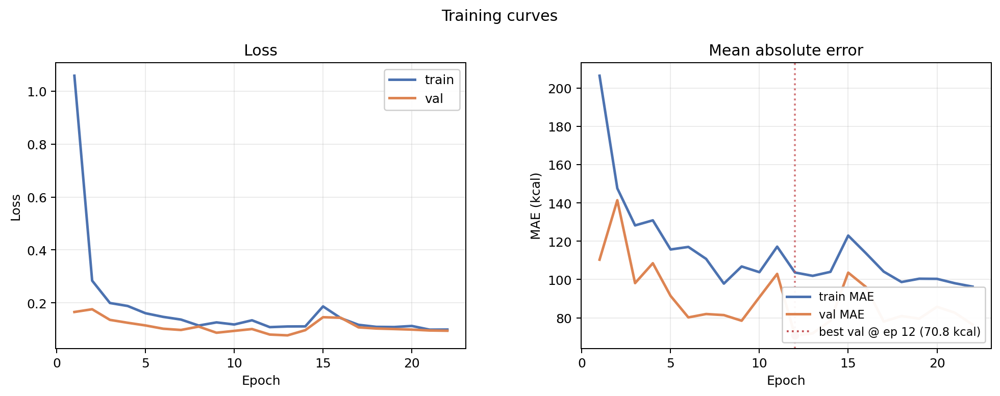</td>
    <td width="50%">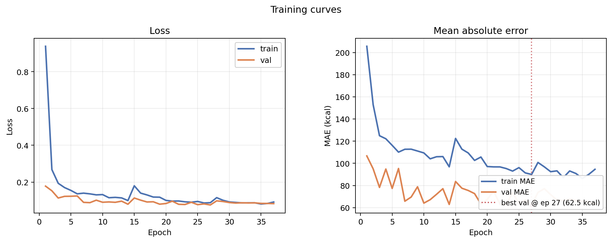</td>
  </tr>
</table>

These plots show training and validation behavior across epochs. The RGB-D model reaches its best validation MAE earlier, while the RGB model improves more gradually.

| Run | Best validation MAE | Best epoch |
|-----|--------------------:|-----------:|
| RGB-D primary | 70.81 kcal | 12 |
| RGB comparison | 65.98 kcal | 23 |

---

## Main Test Metrics

<table>
  <tr>
    <td width="55%">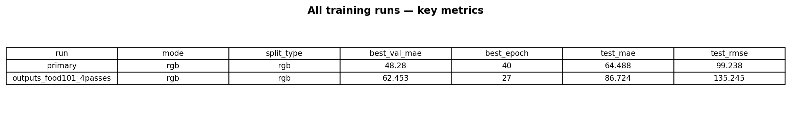</td>
    <td width="45%">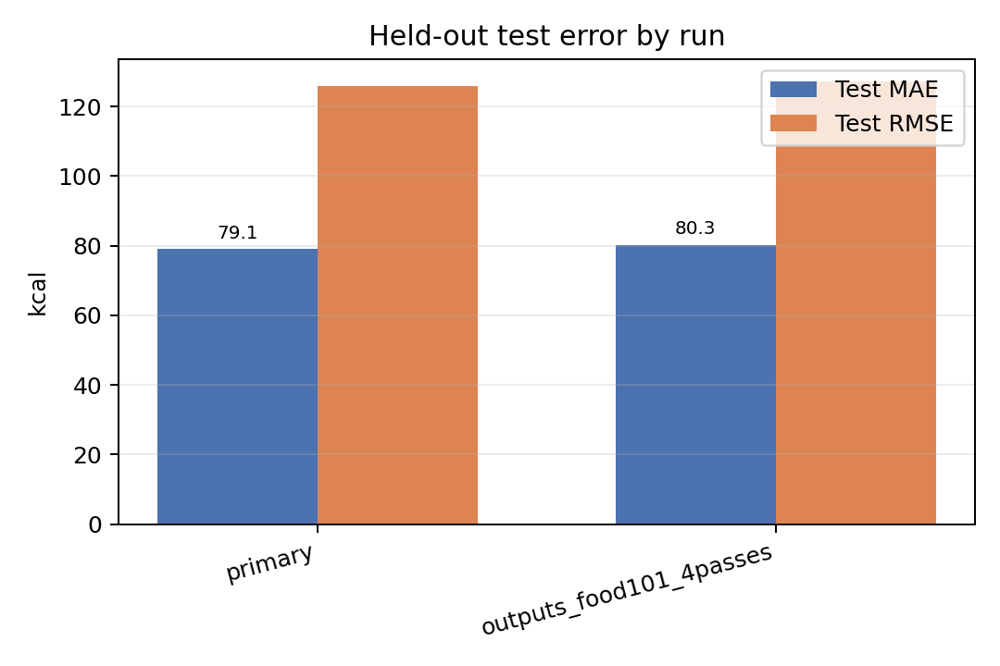</td>
  </tr>
</table>

This result plot compares the two trained models on the held-out test split. Lower MAE and RMSE are better.

| Run | Input | Test MAE | Test RMSE |
|-----|-------|---------:|----------:|
| RGB-D primary | RGB + depth | **79.10 kcal** | **125.89 kcal** |
| RGB comparison | RGB only | 80.31 kcal | 127.35 kcal |

RGB-D improves test MAE by about **1.2 kcal**, so depth helps slightly but does not change the overall difficulty of the task.

---

## What Do MAE and RMSE Mean?

| Metric | Meaning in real life | Our RGB-D result |
|--------|----------------------|-----------------:|
| MAE | average absolute calorie miss per dish | 79.10 kcal |
| RMSE | error metric that penalizes large mistakes more strongly | 125.89 kcal |

An MAE of **79 kcal** means that, on average, the model's prediction is about 79 calories away from the true dish calories. For a rough food-logging assistant, this shows the model learned useful visual signals. For precise nutrition tracking or medical use, it is not accurate enough yet.

The RMSE is much higher than MAE, which tells us there are some large errors. So the model is a solid baseline, but the error analysis is important: the average result alone does not prove the model is production-ready.

---

## Prediction Quality: RGB-D

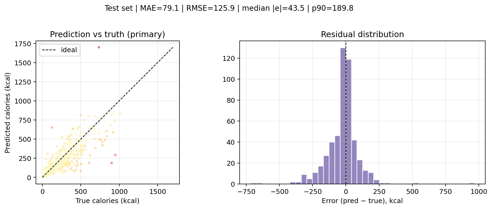

The left plot compares predicted calories with true calories. Points near the diagonal line are good predictions. The model follows the overall trend, meaning it has learned a real relationship between image appearance and calories.

The right plot shows residuals, or prediction error. The spread is wider for high-calorie dishes, which means the model is less reliable when meals contain more food mass or hidden calorie-dense ingredients.

**Mean bias:** predicted minus true = **-24.92 kcal**, meaning the RGB-D model underpredicts on average.

---

## Prediction Quality: RGB

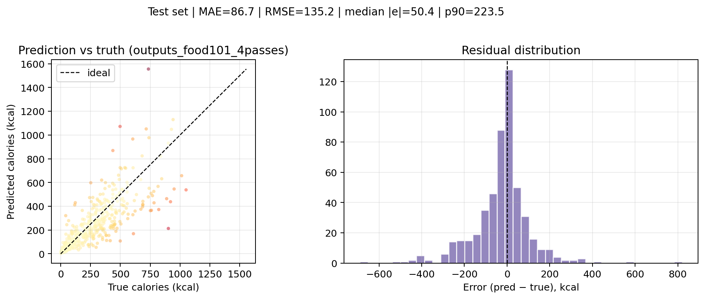

The RGB-only model has a similar prediction pattern to RGB-D. This means the overhead color image already contains strong information about dish type and rough portion size.

Depth still helps slightly in the test metrics, but the small difference shows that depth alone does not solve hidden ingredients or exact mass estimation.

---

## Error by Calorie Level

<table>
  <tr>
    <td width="50%">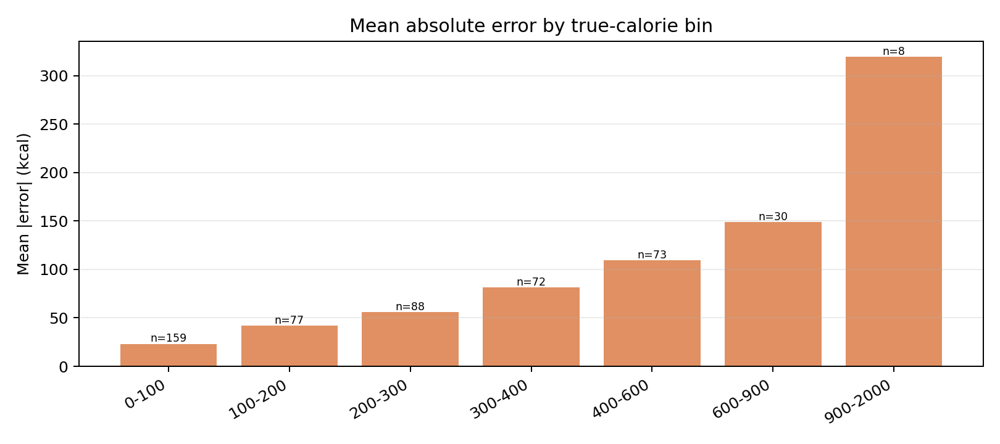</td>
    <td width="50%">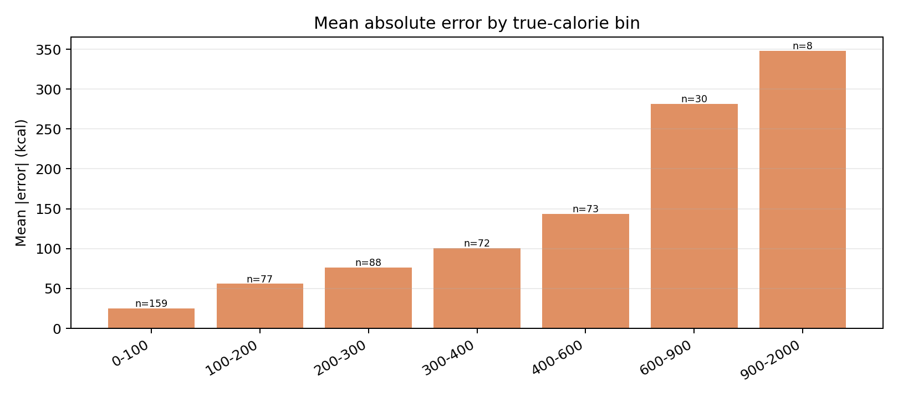</td>
  </tr>
</table>

These plots show that error increases as true calorie level increases. High-calorie dishes are rarer and harder because ingredients and mass are less visible.

| True kcal bin | RGB-D mean absolute error | RGB mean absolute error |
|---------------|--------------------------:|------------------------:|
| 0-100 | 24.24 | 24.10 |
| 100-200 | 56.63 | 53.65 |
| 200-300 | 73.51 | 73.55 |
| 300-400 | 109.38 | 106.17 |
| 400-600 | 126.51 | 133.91 |
| 600-900 | 198.55 | 222.18 |
| 900-2000 | 294.07 | 274.43 |

---

## Absolute Error Distribution

<table>
  <tr>
    <td width="50%">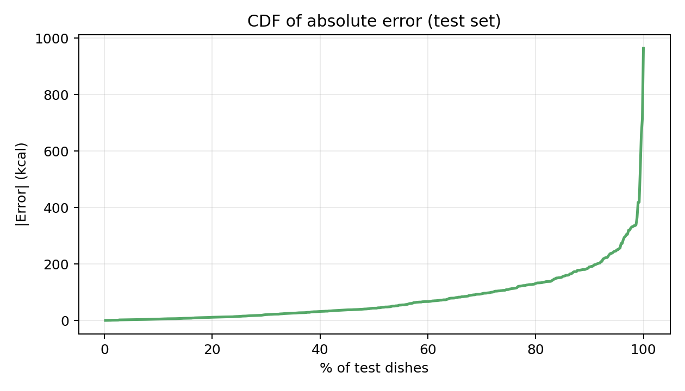</td>
    <td width="50%">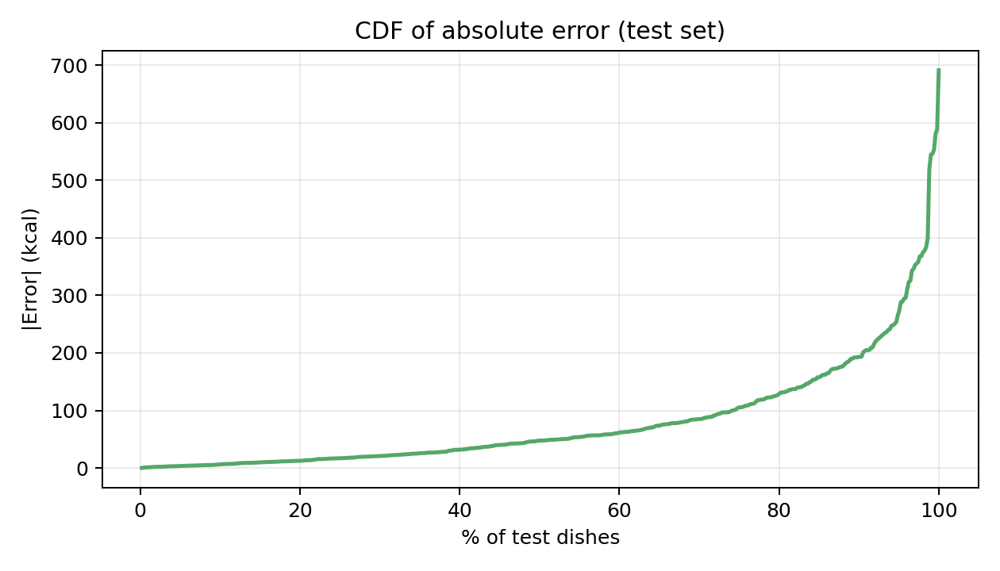</td>
  </tr>
</table>

The CDF shows the percentage of test dishes below each absolute-error level. For RGB-D, about **71.8%** of test dishes are within **100 kcal**.

| RGB-D statistic | Value |
|-----------------|------:|
| Median absolute error | 43.55 kcal |
| 75th percentile | 110.34 kcal |
| 90th percentile | 189.80 kcal |
| Within 50 kcal | 53.3% |
| Within 100 kcal | 71.8% |
| Within 200 kcal | 91.3% |

---

## Web Demo

### Live App

[https://austinwang10-food-calorie-app.hf.space/](https://austinwang10-food-calorie-app.hf.space/)

### Inference Flow

```text
uploaded food image -> preprocessing -> trained checkpoint -> predicted kcal
```

| Mode | Input | Depth Source |
|------|-------|--------------|
| RGB | food image | not used |
| RGB-D | food image + depth cue | MiDaS, heuristic, or uploaded depth map |

The demo loads saved checkpoints and returns a calorie estimate. When the classifier head is available, it can also show candidate food categories.

---

## Data Scope Limitation and Fair Evaluation

The full Nutrition5k release is too large for our group laptops to store and train on comfortably. The main constraint is both **storage** and **hardware training time**, especially because the full dataset includes much more imagery than the overhead subset used here.

| Constraint | Impact on This Project |
|------------|------------------------|
| Dataset size | we train on the local overhead subset that fits available storage |
| Laptop hardware | full-dataset training would be slow and unreliable on our machines |
| Fair comparison | RGB and RGB-D are evaluated with the same fixed local test set |
| Reproducibility | split type, seed, config, metrics, and predictions CSV are saved |

This means we do **not** claim full Nutrition5k leaderboard reproduction. Instead, we present a controlled baseline: all compared models use the same data rules, same held-out test dishes, and same MAE/RMSE metrics.

---

## Future Work

1. Train on more Nutrition5k overhead data when storage and hardware allow.
2. Improve prediction on high-calorie dishes with stronger modeling and calibration.
3. Tom Chen will work on reproducing the paper's approach for a closer reference comparison.

---

## Key Takeaways

1. The project turns Nutrition5k overhead images into a working calorie-estimation pipeline.
2. The best model is RGB-D ResNet-18 with **79.10 kcal MAE** and **125.89 kcal RMSE**.
3. RGB-only is close, so depth helps slightly but is not enough by itself.
4. Because of laptop storage and hardware limits, this is a controlled local-subset baseline rather than a full-dataset reproduction.
5. The biggest errors happen on high-calorie or visually ambiguous dishes.
6. The next best improvements are stronger backbones, better RGB-D fusion, and ingredient/category reasoning.

---

## Appendix: Exact EDA Summary

| Split | Count | Mean | Std | Min | Median | Max |
|-------|------:|-----:|----:|----:|-------:|----:|
| Train | 2160 | 254.53 | 210.72 | 0.00 | 208.13 | 1324.08 |
| Validation | 240 | 272.87 | 211.55 | 2.07 | 247.37 | 1119.28 |
| Test | 507 | 255.47 | 212.24 | 0.00 | 226.01 | 1050.51 |

---

## Appendix: Exact Test Metrics

| Run | Mode | Split type | Best val MAE | Best epoch | Test MAE | Test RMSE |
|-----|------|------------|-------------:|-----------:|---------:|----------:|
| Primary | RGB-D | depth | 70.81 | 12 | 79.10 | 125.89 |
| Comparison | RGB | rgb | 65.98 | 23 | 80.31 | 127.35 |

---

## Appendix: Reproducibility Commands

```bash
python train.py \
  --dataset_root /Users/yiouwang/data/nutrition5k_mini \
  --output_dir outputs_train_rgbd_food101 \
  --mode rgbd --split_type depth \
  --epochs 40 --loss_type smooth_l1 --scheduler plateau \
  --use_log_target --pretrained \
  --enable_food101_cls --food101_root /Users/yiouwang/data \
  --cls_label_smoothing 0.05 --food101_cls_passes 4

python evaluate.py \
  --dataset_root /Users/yiouwang/data/nutrition5k_mini \
  --mode rgbd --split_type depth \
  --checkpoint_path outputs_train_rgbd_food101/checkpoints/rgbd_best.pt \
  --output_dir outputs_train_rgbd_food101 \
  --save_predictions_csv outputs_train_rgbd_food101/logs/test_predictions.csv
```
